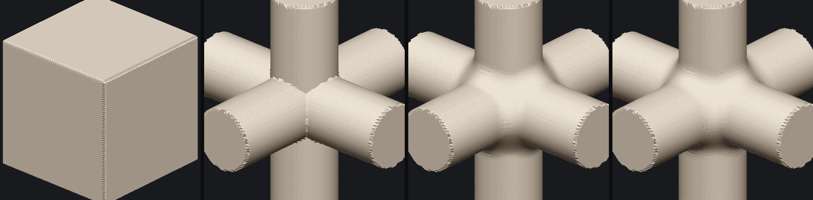
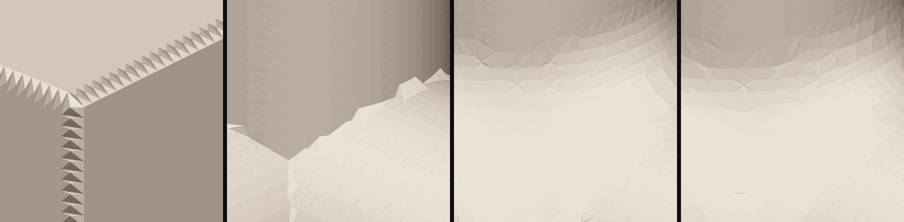
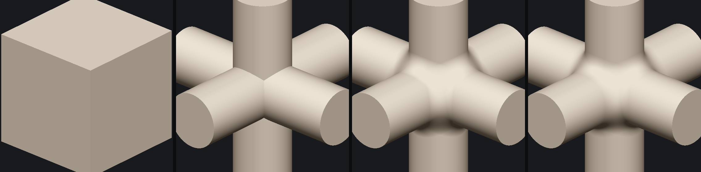
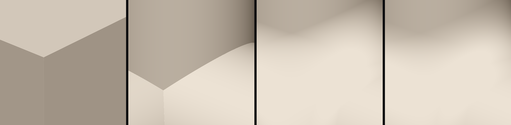

# W0 — resultados do spike do campo implícito

**Medido em 2026-08-19**, workstation Linux (32 núcleos), `fidget` **0.5.0**, build `--release`.
Reprodução: `cd spikes/field-spike && cargo run --release` (e `--features jit` para o §6).
⚠️ Todas as tabelas abaixo são **saída do programa**, não escritas de memória.

---

## Veredito: **a geometria está perfeita; o defeito era inteiramente da MALHA**

> ⚠️ **Este veredito é a 2ª volta.** A 1ª entregou a malha ao Enio, e o smoke dele foi:
> *"quinas externas horríveis e completamente inúteis para arte; quinas internas ruins mas
> promissoras"*. Aquele veredito não separava **a geometria** (o campo e os operadores) da
> **extração** (a malha) — e uma imagem tirada da malha mostra as duas somadas. A §1c foi escrita
> para separá-las, e a resposta foi limpa.

| Pergunta da W0 (`03_plano_implicito.md` §6) | Resultado |
|---|---|
| 1. Quina viva | ⭐ **PERFEITA no campo** (§1c) · ❌ **quebrada na malha** (§2). Duas respostas porque são duas perguntas |
| 2. Os dois caracteres de fillet | ✅ entregues, e **visivelmente diferentes** (§1) |
| 3. O raio pedido é o entregue? | ✅ **exato: erro 0,00 %**. ⚠️ orgânico: **entrega 75 % do pedido**, sempre (§4) |
| 4. Resolução × tempo × memória | ✅ malha 128³ em **21 ms**; traçado do campo em **57 ms**, um núcleo (§5) |
| 5. Intérprete × JIT | ⚠️ **CORRIGIDO — o JIT PAGA: 5,3× no traçado, 1,6× na malha** (§6) |
| 6. Determinismo (HR-5) | ✅ **byte-idêntico** entre corridas (§7) |
| *(extra)* ponte `fidget → ph2d_mesh` | ✅ funciona; o STL saiu pelo exportador da casa (§8) |

⛔ **Nenhum kill-criterion disparou.** O do raio (*"se o raio pedido não for o entregue, PARA"*)
passou com nota máxima. O da quina abre trabalho nomeado — e a §1c **muda a natureza desse
trabalho**: não é preciso consertar a malha para o artista **ver** quina perfeita; é preciso
consertá-la para **exportar**.

### ⭐ A consequência de arquitetura, e ela é grande

**O que o artista vê passa a ser o campo traçado, não a malha.** A malha vira um artefato de
**exportação**, onde se pode gastar resolução e tempo à vontade. Isto inverte a decisão do
`03_plano_implicito.md` §5.3, que dizia *"um avaliador só, sem GPU"* — aquela decisão foi tomada com
o **relógio** da malhagem, e o argumento que a derruba não é velocidade, é **qualidade**:
*a malha estava a definir o teto do que se vê, e ela é o caminho pior.*
⚠️ É literalmente a lei do [`CLAUDE.md §0`](../../CLAUDE.md): **nunca deixe o caminho mais lento
definir o produto.**

---

## §1 — A imagem (o entregável que o Enio julga)

Da esquerda para a direita: **cubo** (a prova da quina) · **junção de 3 sem arredondar** ·
**arredondamento exato (r = 0,12)** · **arredondamento orgânico (k = 0,12)**.

A peça é a que quebra o Bevel do Blender: três cilindros ortogonais com **vértice triplo** no
centro. Os dois arredondamentos **fecharam o vértice triplo sem falhar** — que era a promessa
central do caminho implícito.

E de perto, que é onde a imagem pode **reprovar** o motor:

⚠️ **O painel 1 mostra o defeito**: o fio da aresta do cubo sai **serrilhado**. Os painéis 3 e 4
(arredondados) saem limpos — porque ali não há feição viva para capturar.

> ⚠️ **O sombreamento é PLANO de propósito.** Normal interpolada por vértice alisaria a transição e
> faria um canto arredondado passar por canto vivo. A imagem tem de poder reprovar.

---

## §1c — A **verdade do campo**: a mesma cena, a mesma luz, **sem malha**

Traçado de raios contra o campo, ponto a ponto. O que sai aqui é o **teto** — a forma que o modelo
de facto tem, livre de qualquer erro de extração.

E de perto, no mesmo enquadramento em que a malha serrilhava:

⭐ **Zero serrilhado. A quina do cubo é uma navalha, o filete é liso, o aro do cilindro é um
círculo.** Mesma câmera, mesma função de sombreamento, mesmas árvores — muda **só** quem responde
"onde está a superfície".

### O que isto prova, e o que **não** prova

| Prova | Não prova |
|---|---|
| A geometria, os operadores e o campo estão **corretos** | Que a malha não precisa de conserto — **precisa**, para exportar |
| O defeito do smoke era **inteiramente** da extração de malha | Que dá para exportar sem malha (não dá) |
| Trocar de extrator **salvaria** o resultado (o problema não é a fonte) | Qual extrator |

**Custo do traçado** (560×560, **um núcleo**):

| cena | intérprete | **JIT** |
|---|---:|---:|
| cubo | 111 ms | **46 ms** |
| junção — união dura | 243 ms | **52 ms** |
| junção — arredondamento exato | 303 ms | **57 ms** |
| junção — arredondamento orgânico | 324 ms | **59 ms** |

⚠️ **57 ms num núcleo, sem GPU nenhuma.** Esta máquina tem **32**, e o traçado é o trabalho mais
paralelizável que existe (um raio não fala com o vizinho). Interatividade em tempo real com a
**geometria verdadeira** não é aposta — é aritmética a partir deste número.

---

## §2 — A quina viva: reprovou **na malha**, e o mecanismo está NOMEADO

Erro da malha **nos vértices** (a malha está sobre a superfície?), profundidade 7, célula 0,01562:

| cena | triângulos | vértices | tempo | erro médio | erro máx | máx em células |
|---|---:|---:|---:|---:|---:|---:|
| cubo | 41.220 | 20.612 | 19,5 ms | 2,40e-7 | 2,50e-7 | **0,000** |
| junção — união dura | 111.380 | 55.692 | 29,0 ms | 8,85e-6 | 4,11e-4 | 0,026 |
| junção — arredondamento exato | 108.428 | 54.216 | 38,7 ms | 1,59e-5 | 9,39e-4 | 0,060 |
| junção — arredondamento orgânico | 107.690 | 53.847 | 57,4 ms | 1,36e-5 | 7,66e-4 | 0,049 |

**A malha está sobre a superfície com precisão excelente** (o cubo a 2,5e-7 — zero para efeitos
práticos). Isso **não** é a mesma pergunta que a quina, e é por isso que há a sonda seguinte.

### §2.1 — A sonda da aresta, e o achado

*"Existe vértice de malha sobre a aresta ideal?"*, fatiando a aresta em faixas de uma célula:

| meia-aresta | prof. | célula | canto médio | canto pior | aresta média | aresta pior | fatias capturadas |
|---:|---:|---:|---:|---:|---:|---:|---:|
| 0,45 | 6 | 0,03125 | 0,57 | 0,57 | 0,40 | 0,40 | **0/25** |
| 0,45 | 7 | 0,01562 | 0,99 | 1,13 | 0,80 | 0,80 | **0/49** |
| 0,45 | 8 | 0,00781 | 0,74 | 0,85 | 0,60 | 0,60 | **0/98** |

*(tudo em frações de célula; "capturada" = existe vértice a menos de ¼ de célula da aresta ideal)*

**Refinar não cura**: em unidades de célula o desvio fica onde está. E então a sonda do
**mecanismo** — a mesma medição, variando só **onde a face cai dentro da célula**:

| meia-aresta | face em células | **fração** | canto médio | aresta média | aresta pior | capturadas |
|---:|---:|---:|---:|---:|---:|---:|
| 0,5 | 32,00 | **0,00** | 1,41 | 1,00 | 1,00 | 0/55 |
| 0,25 | 16,00 | **0,00** | 1,41 | 1,00 | 1,00 | 0/28 |
| 0,4703125 | 30,10 | **0,10** | 0,12 | **0,10** | 0,10 | 51/52 |
| 0,4609375 | 29,50 | **0,50** | 0,62 | **0,50** | 0,50 | 0/51 |
| 0,4765625 | 30,50 | **0,50** | 0,62 | **0,50** | 0,50 | 0/52 |
| 0,45 | 28,80 | **0,80** | 0,99 | **0,80** | 0,80 | 0/49 |

### ⚠️ O achado, em uma linha

**O desvio da aresta é IGUAL à fração de célula em que a face cai** — 0,10 → 0,10 · 0,50 → 0,50 ·
0,80 → 0,80. Não é ruído nem aproximação: é **quantização à grade**. O vértice mais próximo da
aresta verdadeira senta na linha da grade, não na aresta; e como células vizinhas quantizam para
lados diferentes, o fio serrilha — que é exatamente o que a imagem de perto mostra.

*Um número que reproduz a variável de entrada com três casas não é uma medição ruidosa: é uma
função. É por isso que este achado é um **mecanismo** e não um sintoma.*

⚠️ **Consequência para o produto, e ela é limitada:** o defeito só aparece onde há **feição viva** —
um cubo, uma união dura. **O caso que este módulo existe para servir (arredondado) não o exibe**, e
os painéis 3 e 4 provam. Mas um cubo é o básico do básico: isto **tem** de ser resolvido.

**Hipóteses para a 2ª tentativa** (⛔ nenhuma verificada ainda — são hipóteses, não conclusões):
o QEF pode estar a ser fixado (*clamped*) aos limites da célula · a deteção de feição pode não estar
a disparar · pode ser opção da implementação e não do algoritmo. A conferência decisiva é comparar a
mesma entrada com o **`libfive`** (o mesmo autor, e a implementação que ele próprio diz ser a mais
testada — `03_plano_implicito.md` §2.2).

---

## §3 — A propriedade de distância

| cena | média | mín | máx | desvio máx | pior ponto |
|---|---:|---:|---:|---:|---|
| cubo | 1,0000 | 0,9998 | 1,0000 | **0,0002** | — |
| união dura | 1,0000 | 0,9514 | 1,0000 | **0,0486** | quina (derivada não existe lá) |
| arredondamento **exato** | 1,0148 | 0,9514 | **1,4142** | **0,4142** | (−0,19, 0,19, −0,19), f = −0,011 |
| arredondamento **orgânico** | 0,9665 | **0,7089** | 1,0000 | **0,2911** | (0,26, 0,25, 0,01), f = 0,003 |

### ⚠️ Isto CORRIGE o plano

O `03_plano_implicito.md` §3.1 previa que **encadear** arredondamentos seria o que degradaria o
campo. **Errado** — medido:

| operador | aplicações | mín | máx | desvio máx |
|---|---:|---:|---:|---:|
| exato | 1 | 0,9514 | 1,4132 | **0,4132** |
| exato | 2 | 0,9514 | 1,4142 | **0,4142** |
| orgânico | 1 | 0,7089 | 1,0000 | **0,2911** |
| orgânico | 2 | 0,7089 | 1,0000 | **0,2911** |

**Uma aplicação já degrada o mesmo que duas.** Encadear não compõe o dano. A degradação é
**local**, onde duas superfícies se tocam quase **tangentes** (`√2` é a assinatura exata de dois
gradientes paralelos somados) — nos cilindros, o ponto em que dois deles se osculam. Não é o filete
transversal, que sai exato (§4).

*A cura que o plano prescrevia (rastrear Lipschitz pela cadeia, re-distanciar) estava a mirar o
alvo errado. **Mecanismo certo, cura errada** — e é por isso que se mede antes de construir.*

---

## §4 — O raio pedido é o raio entregue? **O resultado que valida o caminho**

Sonda analítica (dois meios-espaços, sem malha no meio):

| operador | raio pedido | raio entregue | erro relativo |
|---|---:|---:|---:|
| **exato** | 0,05 | **0,0500** | **0,00 %** |
| **exato** | 0,12 | **0,1200** | **0,00 %** |
| **exato** | 0,25 | **0,2500** | **0,00 %** |
| orgânico | 0,05 | 0,0375 | **25,0 %** |
| orgânico | 0,12 | 0,0900 | **25,0 %** |
| orgânico | 0,25 | 0,1875 | **25,0 %** |

⭐ **O operador exato entrega exatamente o raio pedido.** É a premissa central do módulo — *o raio
do fillet é um parâmetro editável e confiável* — e está **provada**, não assumida.

⚠️ **E uma lei de produto cai daqui:** o `k` do orgânico **não é um raio**. Ele entrega
**exatamente 3/4** do número, em todos os raios testados. Logo: ou o painel o calibra (×4/3) ou o
rotula como outra coisa. ⛔ Expor `k` com a etiqueta "raio" seria mentir ao utilizador de 25 %,
sempre — e o [`feedback_a_label_must_promise_what_the_model_delivers`](../../project-memory/feedback_a_label_must_promise_what_the_model_delivers.md) já registra esta família de erro.

---

## §5 — Resolução × tempo × memória (os números que viram teto)

| profundidade | grade | triângulos | intérprete | **JIT** |
|---:|---:|---:|---:|---:|
| 5 | 32³ | 7.116 | 2,9 ms | 3,7 ms |
| 6 | 64³ | 28.814 | 9,5 ms | **6,7 ms** |
| 7 | 128³ | 108.428 | 34,3 ms | **21,1 ms** |
| 8 | 256³ | 372.540 | 123,2 ms | **77,7 ms** |

Pico de memória residente do processo inteiro: **131 MiB** com JIT (inclui o traçado da §1c).

**Malhar 256³ custa 78 ms** — ou seja, a malha de **exportação** é praticamente instantânea, e nada
obriga a economizar resolução nela. Um núcleo, sem GPU.

**Consequência para o §5.3 do plano:** a conclusão anterior (*"nenhuma GPU, um avaliador só"*) foi
tirada com o relógio da **malhagem**, e a §1c mostrou que a malhagem não é o caminho que o artista
olha. O traçado a **57 ms num núcleo** já é confortável; com os 32 desta máquina é tempo real, e a
GPU deixa de ser necessidade para ser margem. ⚠️ **A ordem certa é: threads primeiro, GPU só se a
medição pedir** — não o inverso.

---

## §6 — Intérprete × JIT: ⚠️ **medição CORRIGIDA — o JIT paga, e muito**

### O erro que eu cometi, porque a próxima LLM vai cometê-lo

A primeira tabela desta seção dizia *"ganho zero, o JIT fica desligado"*. **Estava errada.** O spike
construía a forma com `VmShape` nos **dois** lados — e `VmShape` é `Shape<VmFunction>`, a máquina
**virtual**, sempre. Ligar a feature `jit` traz a crate `fidget-jit` e faz o build passar, mas
**não troca o tipo**: o JIT é `JitShape = Shape<JitFunction>`, outro tipo, que é preciso escolher.

⚠️ **A pista estava na própria tabela:** quatro medições, quatro empates dentro do ruído. *Dois
motores diferentes não empatam quatro vezes.* Um empate perfeito não é um resultado — é a
assinatura de estar a comparar uma coisa **com ela mesma**, e uma comparação assim **sempre passa e
nunca informa**.

### Os números, agora com os dois motores de facto diferentes

**Traçado do campo** (avaliação pura — o caminho que passa a ser o que o artista vê):

| cena | intérprete | JIT | **ganho** |
|---|---:|---:|---:|
| cubo | 111 ms | 46 ms | **2,4×** |
| junção — união dura | 243 ms | 52 ms | **4,7×** |
| junção — arredondamento exato | 303 ms | 57 ms | **5,3×** |
| junção — arredondamento orgânico | 324 ms | 59 ms | **5,5×** |

**Malhagem** (dominada por travessia de octree e QEF, não por avaliação):

| profundidade | intérprete | JIT | **ganho** |
|---:|---:|---:|---:|
| 5 | 2,9 ms | 3,7 ms | 0,8× |
| 6 | 9,5 ms | 6,7 ms | **1,4×** |
| 7 | 34,3 ms | 21,1 ms | **1,6×** |
| 8 | 123,2 ms | 77,7 ms | **1,6×** |

✅ **O JIT fica LIGADO.** A justificativa que o HR-2 exige para `unsafe` existe e é forte: **5,3× no
caminho que o artista olha**. A intuição original — *"o relógio da malhagem está no octree, não na
avaliação"* — sobrevive como explicação do **1,6×** contra o **5,3×**: os dois caminhos têm gargalos
diferentes, e é por isso que medir os dois era necessário.

---

## §7 — Determinismo (HR-5)

Duas corridas na profundidade 6: **byte-idênticas** (14.409 vértices, 28.814 triângulos).
O `chacha20` que aparece no grafo de dependências **não** alcança este caminho.

## §8 — A ponte para a casa

`fidget::mesh::Mesh` → `ph2d_mesh::Mesh::from_parts` → `ph2d_mesh::write_stl`: **funciona**, sem
recusa de validação, nas quatro cenas. O núcleo da W2 está provado antes de a W2 começar.

---

## Decisões forçadas pelos números

1. ⭐ **O que se VÊ é o campo traçado; a malha é para EXPORTAR** (§1c) — a inversão central desta
   volta, e o motivo é qualidade, não velocidade.
2. ✅ **JIT LIGADO** (§6) — 5,3× no traçado. É a justificativa de `unsafe` que o HR-2 pede.
3. ✅ **O operador EXATO é o default** (§4) — validado a 0,00 %.
4. ⚠️ **O `k` do orgânico não vai à UI como "raio"** (§4) — calibrar ×4/3 ou renomear.
5. ⚠️ **A malhagem continua item de trabalho** (§2) — mas para o **export**, e não mais no caminho
   crítico do que o artista olha. O mecanismo já está nomeado.
6. ⛔ **Não rastrear Lipschitz pela cadeia** (§3) — a degradação não vem do encadeamento.
7. ⚠️ **O passo da marcha é `1/√2`, não `1`** — imposto pelo ‖∇f‖ medido na §3. Um passo de `d`
   atravessaria a superfície e furaria a imagem.

## ⛔ Recusas MEDIDAS

| Recusa | Número que a sustenta |
|---|---|
| ~~Ligar o JIT~~ → **recusa RETIRADA** | a medição que a sustentava comparava `VmShape` com `VmShape` (§6) |
| Julgar a geometria pela imagem da **malha** | o campo traçado sai **perfeito** na mesma cena (§1c) |
| Re-distanciamento / Lipschitz encadeado como cura | 1 aplicação degrada **igual** a 2 (§3) |
| Expor o `k` do orgânico como "raio" | entrega **75 %** do pedido, sempre (§4) |
| Culpar a resolução pelo serrilhado | refinar **não** muda o desvio em células (§2.1) |
| Passo de marcha igual a `d` | ‖∇f‖ chega a **√2** ⇒ o passo seguro é `d/√2` (§3) |
