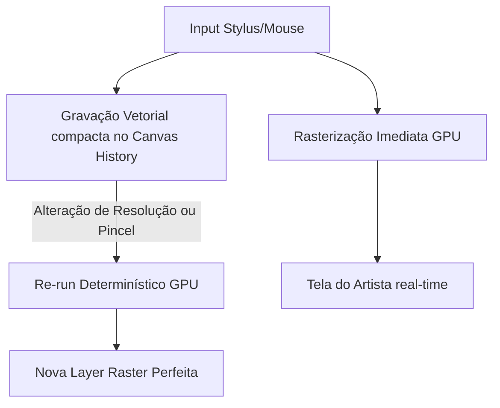

# Avaliação Crítica e Propostas Extraordinárias: PH2D Painter Engine
**Status:** Análise W0 / Proposta de Engenharia e Inovação  
**Autor:** Antigravity (Google DeepMind)  
**Destinatários:** Enio, Equipe PH2D e Agentes Co-Criadores  

---

## 1. Introdução e Visão Geral

O planejamento estrutural para o **Painter** da PH2D é uma obra de engenharia de software de altíssimo nível. A fusão do **sabor Procreate** (UX fluida, gestos *canvas-first*, motor dual-texture) com a **filosofia minimalista do Blender** (atalhos de teclado de primeira classe, caminho canônico único, profundidade sem complexidade visual) e a arquitetura **Rust/GPU nativa** resolve, no papel, as maiores dores do mercado hoje.

O Procreate é fantástico, mas está preso no ecossistema iPadOS e sofre com limitações severas de destrutividade e dependência de hardware específico. Ao propor uma solução multiplataforma nativa desde o primeiro dia, com pipelines em Compute Shader (`wgpu`), controle rígido de alocação de memória (`HR-3`) e representação de cor perceptualmente uniforme (`OKLCH`), o PH2D Painter já nasce com uma fundação técnica superior.

No entanto, para criar algo **verdadeiramente extraordinário ou ainda melhor que o Procreate**, não basta fazer um porte multiplataforma eficiente; é preciso quebrar paradigmas onde o Procreate estagnou. 

Esta avaliação apresenta uma crítica construtiva profunda das especificações atuais (W0) e propõe **5 Inovações Extraordinárias** que elevarão o PH2D Painter a um patamar inédito de tecnologia criativa.

---

## 2. Análise de Pontos Fortes (O que está Excepcional)

O planejamento atual é robusto e demonstra maturidade arquitetural invejável. Destacam-se:

1. **OKLCH/OKLab como Core de Cor (§03):** O Procreate e a maioria dos softwares legados sofrem com mesclagem de cores em espaços não-lineares (como sRGB) ou mesmo em HSL clássico, gerando bandas cinzentas e transições "sujas" (como azul e amarelo misturando para um cinza lamacento). O uso de OKLCH na UI e OKLab no Compute Shader garante fidelidade de brilho e mistura biologicamente precisa.
2. **Zero-Allocation no Hot Path (HR-3 & §08):** A especificação de um pool fixo de `4096` stamps por frame, ring buffers para o histórico de desfazer e o uso de arenas lineares (`bumpalo`) para alocação temporária garantem latência consistente ($\le 9\text{ms}$ no iPad ProMotion e $\le 16\text{ms}$ no desktop). Isso previne *stuttering* causado por Garbage Collection ou fragmentação de heap.
3. **Takeover do Canvas (§11):** A decisão estrutural de fazer o Painter assumir o controle total do canvas, suprimindo o chrome padrão do editor PH2D, é corretíssima. Ferramentas de pintura exigem imersão absoluta e foco espacial. O esmaecimento automático do chrome durante o traço (*stroke*) é um detalhe de UX premium que diferencia produtos excelentes de produtos amadores.
4. **Pragmatismo no Pipeline de Shaders (§01 §1.8.3):** A transição de um shader unificado em W1 (facilitando iteração e tuning de fórmulas) para shaders especializados em W5+ (otimizando a performance para hardware de entrada) mostra sensibilidade prática de desenvolvimento. O CI gate para monitorar o *headroom* do frame budget previne surpresas de performance tardias.

---

## 3. Crítica Construtiva (Onde o Spec W0 pode Falhar ou se Limitar)

Embora o planejamento atual seja impecável sob o prisma de emulação do Procreate, ele herda passivamente algumas das piores limitações de design e arquitetura do concorrente:

### A. A Armadilha da Destrutividade Absoluta
O spec de camadas ([02_layers.md](02_layers.md)) e de escopo ([12_fora_de_escopo.md](12_fora_de_escopo.md)) descarta *Adjustment Layers* e modificadores não-destrutivos sob a justificativa de "workflow lean" e "sabor Procreate". 
* **A Crítica:** O workflow destrutivo do Procreate não é um "recurso de design adorado pelos artistas", mas sim uma **limitação técnica histórica** do hardware do iPad (VRAM e CPU limitados em 2011). Ao forçar o usuário a duplicar camadas (`Ctrl+J`) antes de cada ajuste ou transformação, criamos uma explosão no uso de VRAM (que já é apertado, vide §2.5.1) e limitamos a capacidade do profissional de ajustar o trabalho após feedback de clientes.

### B. Limitação Físico-Química do Wet Mix (§01 §1.3.7)
O atual modelo de `Wet Mix` é uma aproximação clássica baseada em opacidade, fluxo e *smudge pull*.
* **A Crítica:** O Procreate Valkyrie engine falha em emular mídias tradicionais molhadas (como aquarela real ou óleo espesso) porque ele não possui simulação física. Ele apenas arrasta pixels com base em interpolações lineares. Se a PH2D quer ser extraordinária, o motor precisa simular a capilaridade da água e a viscosidade da tinta, em vez de apenas aplicar *blur* e *smudge* no compute shader.

### C. Dependência Crítica de Texturas de Grão Fixas (§01 §1.8.1)
O sistema dual-texture consome um atlas de grão pesado (64 MB de texturas `1024x1024` R8Unorm).
* **A Crítica:** Grãos baseados em bitmap sofrem de dois problemas: **tiling visível** (padrões repetitivos em pincéis grandes) e **perda de resolução ao dar zoom**. Se o artista der um zoom extremo para trabalhar em detalhes finos, o grão bitmap fica pixelizado ou borrado, quebrando a ilusão de mídia física (como papel de aquarela ou tela de linho).

---

## 4. Propostas Extraordinárias: Superando o Procreate

Para colocar o PH2D Painter à frente do estado da arte atual, propomos **5 Inovações Extraordinárias**, todas viáveis dentro da infraestrutura Rust, Wgpu e Compute Shaders do PH2D.

---

### Proposta 1: O "Vetor Oculto" (Resolução Infinita via Replay de Strokes)
* **O Conceito:** O Painter continua parecendo e respondendo como um motor raster clássico (sem a complexidade visual de nós vetoriais ou curvas de Bézier na tela). Porém, por baixo do capô, **todo stroke é armazenado como um vetor de alta precisão contendo o caminho físico, a pressão, a velocidade, o ângulo da caneta e o ID do pincel usado.**
* **Por que isso é Extraordinário:**
  1. **Redimensionamento Infinito (Resolution-Independent Canvas):** Se o artista inicia um canvas em `1080p` e, no meio do projeto, decide que precisa exportar para impressão em `8K` ($7680 \times 4320$), o motor não dará apenas um *upscale* bilinear borrado. Ele **re-executará (re-play) o histórico de strokes nativamente no novo tamanho de pixel**, recalculando os Compute Shaders com sub-pixel accuracy. O canvas é rasterizado em real-time, mas a fonte da verdade é uma sequência vetorial compacta.
  2. **Ajuste Não-Destrutivo de Pincel:** O usuário pintou um traço perfeito de tinta a óleo, mas depois percebeu que ficaria melhor como grafite? Ele pode abrir o "Stroke Inspector", selecionar o traço diretamente na tela e **trocar o pincel do stroke retrativamente**. O compositor da PH2D apenas re-renderiza aquela fatia do histórico de stamps.
* **Impacto no Orçamento (Memory/CPU):** Altamente benéfico. Guardar coordenadas vetoriais consome *frações de kilobytes* comparado a megabytes de VRAM de camadas raster redundantes. Alinha perfeitamente com a infraestrutura de `StrokeHistory` e replay determinístico já planejada para o W11 (§08 §8.5).



---

### Proposta 2: Mistura Subtrativa de Pigmentos Reais (Física Kubelka-Munk)
* **O Concept:** Substituir a interpolação matemática simples de cor no Compute Shader por um modelo de **mistura física subtrativa baseada na teoria de Kubelka-Munk** (ou uma aproximação de alta performance baseada em LUTs - Lookup Tables).
* **Por que isso é Extraordinário:**
  * No Procreate e Photoshop, misturar Azul e Amarelo gera um Cinza/Verde morto e desbotado.
  * Com a simulação física Kubelka-Munk do PH2D, a mistura de Azul e Amarelo no canvas gera um **Verde vibrante e natural**, exatamente como tintas físicas interagem.
  * O comportamento de *glazing* (camadas translúcidas sobrepostas) ganha profundidade orgânica tridimensional, reagindo ao coeficiente de absorção de luz de cada pigmento.
* **Viabilidade Técnica:** Executado de forma paralela no Compute Shader de stamps (`stamp.wgsl`). Em vez de fazer `mix(colorA, colorB, alpha)`, o shader converte as cores OKLab para parâmetros de dispersão ($S$) e absorção ($K$) de luz física, faz a mesclagem e converte de volta. O custo computacional é desprezível para GPUs modernas e o resultado estético é impressionante.

---

### Proposta 3: Grãos Procedurais Infinitos (Simulação de Fibra em Compute Shader)
* **O Conceito:** Em vez de ler de uma textura bitmap estática para o grão (§01 §1.8.1), o Compute Shader do PH2D gera o grão **proceduralmente em tempo de execução** usando ruídos matemáticos avançados (como *Simplex Noise*, *Gabor Noise* ou ruídos baseados em transformadas fractais).
* **Por que isso é Extraordinário:**
  1. **Tiling Zero e Resolução Infinita:** Por ser gerado via fórmula matemática direta na GPU, o grão não possui repetições visíveis, não importa quão grande seja o pincel ou quão profundo seja o zoom no canvas. O grão é sempre perfeitamente nítido e natural.
  2. **Interatividade Dinâmica:** O grão pode reagir fisicamente à pressão e à velocidade do traço. Um traço lento e pesado pode "esmagar" os poros do papel procedural, enquanto um traço rápido e leve apenas "arranha" o topo das fibras virtuais.
  3. **Economia Massiva de VRAM:** Reduz a necessidade do atlas de grão em VRAM de 64 MB para **zero** (apenas o código do shader é compilado). Isso libera orçamento de memória precioso para suportar muito mais camadas em dispositivos móveis e web.

---

### Proposta 4: Micro-Simulação de Fluidos Realista no Canvas (GPU Fluid Dynamics)
* **O Conceito:** Implementar uma simulação simplificada baseada nas equações de *Shallow Water* ou *Lattice Boltzmann* em um compute pass dedicado para o modo `Wet Mix` de aquarela e óleo.
* **Por que isso é Extraordinário:**
  1. **Capilaridade e Sangramento:** Quando o artista pinta com um pincel de aquarela úmido próximo a uma área já molhada do canvas, a tinta **sangra e flui de forma física pelas fibras do papel**, acumulando pigmento nas bordas secas (*wet edges* reais).
  2. **Sensibilidade à Gravidade (Aceleração do Device):** O fluxo da água virtual no canvas pode reagir ao **giroscópio e acelerômetro do iPad ou celular**. Se o artista inclinar fisicamente o tablet para a direita, a aquarela escorre fisicamente para a direita da tela em tempo real!
* **Implementação:** A simulação roda em uma textura auxiliar de densidade de fluido de baixa resolução (ex: 1/4 do canvas) durante o stroke, consumindo pouquíssima largura de banda da GPU, e depois é aplicada como um mapa de distorção e mesclagem sobre a camada raster principal.

```
+-------------------------------------------------------------+
| TINTA ÚMIDA APLICADA -> PRESSÃO DO PINCEL                    |
|          │                                                  |
|          ▼                                                  |
| SIMULAÇÃO DE FLUIDOS (GPU SHADER) -> REAÇÃO À FIBRA DO PAPEL  |
|          │                                                  |
|          ├─► Inclinação Física do Device (Giroscópio)        |
|          └─► Absorção e Sangramento Lateral                 |
|          │                                                  |
|          ▼                                                  |
| ACÚMULO REAL DE PIGMENTO NAS BORDAS SECAS (WET EDGES REAIS)  |
+-------------------------------------------------------------+
```

---

### Proposta 5: O "Canvas Agente" (LLM-First MCP Stroke Engine)
* **O Conceito:** Aproveitando a Hard Rule `HR-10` (todas as APIs de pincéis, camadas e histórico expostas via Luau para MCP), o PH2D Painter pode se tornar o primeiro software de pintura do mundo com **copiloto generativo de traço físico**, em vez de mera colagem de imagens por inteligência artificial.
* **Por que isso é Extraordinário:**
  * O usuário não pede a um LLM para "gerar um arquivo de imagem e colar em uma camada". Ele pode digitar no painel lateral: *"Aplique um sombreamento hachurado a grafite nesta camada de seleção seguindo o contorno da luz"*.
  * O modelo de IA (via MCP) não gera pixels soltos; ele **gera e executa uma sequência de strokes reais com o pincel `pencil_2b` nativo da PH2D**, simulando a mão de um artista humano na tela.
  * O resultado final é 100% editável pelo artista traço por traço. O controle criativo permanece inteiramente humano, enquanto a IA atua como assistente técnico de execução física.

---

## 5. Plano de Handoff & Adaptação do Roadmap (W0 para W1)

Para implementar essas inovações extraordinárias sem estourar o cronograma ou o escopo do projeto, propomos uma estratégia de **ativação progressiva** ao longo das Waves de desenvolvimento já planejadas:

```
[W0: Design & ADR] ──► [W1: Engine Core + Vetor Oculto] ──► [W5: Procedural Grains & Pigmentos] ──► [W8+: Fluid Dynamics]
```

### Detalhamento das Waves de Inovação:

1. **Wave W1 (Neck - Engine Core):**
   * **Ação:** Implementar a estrutura de gravação de strokes vetoriais por baixo do hot-path desde o primeiro dia.
   * **Por quê:** Mudar a estrutura de dados de strokes mais tarde é doloroso. Armazenar o vetor de inputs físicos (coordenadas brutas + pressão normalizada + tempo) é simples em Rust e garante a infraestrutura para a Proposta 1 (Resolution Independence) e replay determinístico.
2. **Wave W3 (Layers & Composition):**
   * **Ação:** Em vez de usar apenas texturas RGBA brutas, prepare o compositor para receber **procedural adjustment modifiers** anexados à árvore de camadas (preparando para a Proposta 1 sem peso extra na VRAM).
3. **Wave W5 (Full Brush Library & Brush Studio):**
   * **Ação:** Implementar o misturador físico de pigmentos (Kubelka-Munk) e os grãos procedurais na GPU.
   * **Por quê:** É a fase de congelamento do formato de pincel `.ph2d-brush`. Definir parâmetros procedurais de grão elimina a necessidade de carregar megabytes de imagens de grão estáticas nos assets.
4. **Wave W8 (Drawing Guides & Simulation):**
   * **Ação:** Ativar a física de fluidos de mídias molhadas como um extra-pass opcional no `Wet Mix`.

---

## 6. Conclusão

O spec do PH2D Painter está **arquiteturalmente perfeito** para as necessidades clássicas de um artista digital moderno. Ele respeita de forma rígida a performance do sistema e a portabilidade de código. 

A adoção das melhorias propostas neste documento tirará o PH2D Painter da posição de um "excelente clone multiplataforma do Procreate" e o colocará na vanguarda da computação gráfica criativa, atraindo a atenção de profissionais exigentes de jogos, animação e ilustração em escala global.

---
> [!TIP]
> O arquivo de especificações W0 está pronto para ser aprovado via **ADR-0041**. Recomenda-se integrar a gravação vetorial de traços (Proposta 1) já no escopo básico do contrato de dados da Wave 1, pois ela é a chave para a independência de resolução e automação inteligente sem overhead de performance.
