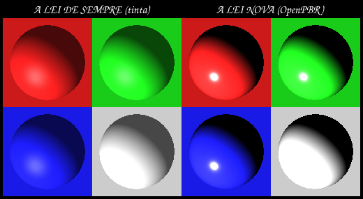

# 15 — AS METAS: bater todas as game engines em BELEZA e PERFORMANCE

> **Ordem do dono, 2026-09-20:** *«escolha o que for melhor para vc mas documente as metas: bater
> todas as game engines em beleza e performance»*.

⚠️ **«Bater» não é uma especificação, e «beleza» menos ainda.** Esta página parte as duas palavras
em colunas que se MEDEM, com o número de cada concorrente ao lado — medido nesta máquina, não
citado. ⛔ Uma meta sem número é uma opinião com data.

⚠️ **O produto que estas metas descrevem é o do [`14` §5](14_a_ordem_de_superar.md):** uma engine
**2D** — jogabilidade, física e colisor em duas dimensões — cujos **objectos** podem ser malhas 3D
reais, iluminadas e animadas em 3D, projectadas no canvas. *A simplicidade do 2D com o melhor da
aparência 3D.*

---

## §1 — Os cinco concorrentes, e como foram medidos

| motor | versão | como o medi |
|---|---|---|
| **Godot** | 4.7.2 (MIT) | **corrido** — `--doctool` sobre 810 classes |
| **Blender EEVEE Next** | 5.2.2 | **corrido** — `--background --python-expr`, API em tempo de execução |
| **Unreal** | 5.8.2 | instalado (73 GB) · ⛔ o fonte é restrito: só a API e a execução |
| **Unity HDRP** | 6000.7.0b1 | instalado · pacotes de pipeline lidos do editor |
| **Frostbite** (o ALVO) | BfN, 2019 | ⛔ não licenciado — só fontes públicas ([GDC 2018](https://media.contentapi.ea.com/content/dam/eacom/frostbite/files/gdc2018-precomputedgiobalilluminationinfrostbite.pdf)) |

---

## §2 — ⭐ BELEZA: as colunas, com a barra de cada uma

| # | coluna | nós HOJE | o melhor deles | **META** |
|---|---|---|---|---|
| B1 | **campos de material** (norma OpenPBR = 41) | **21** | Blender **32** (Principled BSDF) | **41** — a norma inteira |
| B2 | **material por PIXEL** (texturas) | ⛔ **zero** — uma cor por objecto | todos têm | albedo · normal · rugosidade · metal · oclusão |
| B3 | **luz indirecta** | sondas, **só com a câmera parada** | Godot SDFGI · EEVEE ecrã+temporal | **ligada em movimento** |
| B4 | **subsuperfície** (a assinatura do alvo) | ✅ dois caminhos, paridade `100 %` | Blender ✅ · Godot ⛔ | manter, e levá-la ao SPRITE |
| B5 | **camada de estilo** com botões | ✅ 4 (contorno · curvatura · zona · saturação) | ⛔ **nenhum tem nativo** | manter a vantagem |
| B6 | ⭐⭐⭐ **luz re-derivada da FORMA, por quadro, num objecto 2D** | ⛔ | ⛔ **NENHUM tem** — todos usam normal map FIXO | **a rota B** |

### ⭐⭐⭐ B6 é a meta que nos torna únicos, e a razão é estrutural

Unity, Godot e Unreal fazem 2D iluminado com **mapas de normais fixos** — uma fotografia da forma.
Gira-se o sprite e a luz **não acompanha**. O [`02.2`](../3D/02-Arquitetura/02.2-Sprite-com-malha-filha.md)
chama-lhe, por escrito, *«o efeito que nenhum sprite normal-mapeado comum consegue»*.

⇒ Eles não podem fazê-lo porque **não têm a forma em tempo de execução**. Nós temos — e é a mesma
razão do [`14` §4](14_a_ordem_de_superar.md): eles traçam contra aproximações (proxy, voxel, ecrã,
pré-cálculo) e nós contra a forma verdadeira.

---

## §3 — ⏱️ PERFORMANCE: as barras, e o recurso de cada uma

| # | coluna | nós HOJE | eles | **META** |
|---|---|---|---|---|
| P1 | quadro com a câmera a MEXER, **luz ligada**, `1920×1080` | ⛔ a luz está **desligada** | `16,7 ms` com tudo | **≤ 16,7 ms com tudo ligado** |
| P2 | quadro **parado**, `1920×1080` | `~61 ms` (medido, uma cena) | — | **≤ 16,7 ms** |
| P3 | objectos em **rota B** (3D ao vivo) num quadro | ⛔ não existe | — | ✅ **MEDIDO** ([`17` §4](17_a_rota_b_o_catavento.md)): `59`/`45`/`26`/`8` a `128²`/`256²`/`512²`/`1024²`, e o elo que manda é **acender** |
| P4 | objectos em **rota A** (assado) | = um sprite | = um sprite | manter: **roda em telemóvel** |

⚠️ **`16,7 ms` é `60` imagens por segundo, e é a barra porque é a deles.** Não é um número escolhido:
é o orçamento de um quadro a 60 Hz, que é o que os cinco entregam.

⛔ **Toda leitura desta tabela vale apenas com `loadavg < 10`, em `--release`, com a ociosidade real
impressa ao lado.** A `line/3DModeling` já pagou duas vezes por medir sob carga
([handoff §10.3](../3DModeling/handoffs/HANDOFF_INTEGRACAO_line_3DModeling_A_LINHA_2026-09-20.md)).

---

## §4 — ⛔ O que NÃO prometemos, e dizê-lo poupa uma jornada

Uma meta honesta declara o que fica de fora. Estas quatro ficam, **por medição ou por desenho**:

| fora | porquê |
|---|---|
| **escala de conteúdo** (Nanite, virtual textures, streaming) | anos-pessoa de engenharia de dados; e o alvo não os usa — [`02` §4](02_o_estado_da_arte.md) |
| **GI dinâmica a 60 Hz** | ⭐ **o próprio ALVO não a tem**: o Frostbite pré-calcula com Enlighten. Persegui-la é gastar onde o alvo não gastou |
| **jogabilidade 3D** | é o DESENHO da engine, não uma falta ([`14` §5](14_a_ordem_de_superar.md)) |
| **hardware de raios** | se a resposta certa for ReSTIR, eles chegaram primeiro e melhor |

---

## §5 — A ordem de ataque, e porque ESTA

⭐ **Escolhida por «salto visual por unidade de trabalho», sobre infraestrutura que já existe.**

| ordem | obra | porquê primeiro | fecha |
|---|---|---|---|
| **1.ª** | **a lei que acende o sprite passa a ser o PIPELINE BOM** | ⭐ a rota A **já está construída e no ECS**; o que faz o objecto parecer de 2010 é a LEI, não a infraestrutura | **B1 · B4 · B5** no sprite |
| 2.ª | **a rota B** — o objecto 3D ao vivo (o catavento) | produz o mesmo G-buffer, agora por quadro | **B6** · `P3` |
| 3.ª | **a luz sobrevive ao movimento** (sondas persistentes) | toda medida e à espera; é `P1` | **B3 · P1 · P2** |
| 4.ª | **texturas** | o maior buraco contra os cinco numa comparação lado a lado | **B2** |
| 5.ª | **animação 3D** do objecto | é o que faz a rota B valer a pena | fecha o catavento |

### ⭐⭐⭐ O ESTADO desta fila — **auditado contra o código em 2026-09-21**

⚠️ **Esta tabela é a resposta a *«qual é a próxima etapa?»*, e é o único sítio onde ela se lê.**
Quem a responder por memória ou pelo [`03`](03_o_plano.md) responde a fila errada — já aconteceu.

| ordem | obra | estado |
|---|---|---|
| **1.ª** | a lei que acende o sprite | ✅ **NO PRODUTO, com o smoke do dono APROVADO (21/09)** e com a **escolha POR OBJECTO gravada no ficheiro** (o item `2` da cauda, fechado no mesmo dia — degrau `161`). ⏳ fica o resto da cauda do §7 (o destaque que satura · a oclusão especular · não re-enviar a forma quando só o rig mudou) |
| **2.ª** | a rota B — o catavento | ⏳ **EM CURSO.** A **§5.0 está medida** ([`17`](17_a_rota_b_o_catavento.md)): as duas metades já vivem na placa e **a costura entre elas passa pela CPU** — chamar a porta de hoje por quadro dá `4` objectos a `512²` contra **`26`** com o G-buffer residente. ⚠️ E a §5.0 corrigiu-se a si mesma: a 1.ª conta lia `126` por medir **metade da corrente** (rasterizar custa VÉRTICES e é plano no lado; **acender** custa ÁREA e é o elo que manda). ⭐⭐⭐ **E o Bloco E respondeu de que ROTAÇÃO é esta obra:** a rota A já dá a rotação **no plano** **exactamente** (`0,00°` contra `28,58°` de um plano fixo — duas operações 2D sobre o plano assado), e **fora do plano** não há operação 2D nenhuma (`31,69°`). ⛔ Logo a pose 3D tem de viajar no COMPONENTE: o `Transform` tem `rotation: f32` e exprime só o plano do ecrã. ⭐⭐⭐ **E EM 21/09 ela CHEGOU À CENA** ([`17` §5–§7](17_a_rota_b_o_catavento.md)): a costura residente (W1, `f32` byte-idêntico), a corrente viva numa porta (W2, `26×` num quadro) e o **componente + fase + cena `=53`** (W3). O `ph2d_ecs::Mesh3D` **existe** (`piece`, `yaw`, `pitch`, `spin`; `PROJECT_SCHEMA` `161 → 163`) e ⛔ o **`MeshShading` NÃO** — por medição: o material é global e a escolha por objecto já é a `Lei` gravada. ⏳ **ABERTO:** ele não tem CONTROLO (só uma cena o semeia) e o custo com **N** cataventos não foi varrido |
| 3.ª | a luz sobrevive ao movimento | ⏳ **absorve a `W9`** do [`03`](03_o_plano.md), com o gate VERMELHO que o dono mandou tratar lá |
| 4.ª | texturas | ⏳ o material continua **uma cor por objecto** |
| 5.ª | animação 3D | ⏳ o esqueleto desta casa é 2D |

⭐ **E a 1.ª obra tem um capítulo que esta página não conta:** o dono reportou **cinco** vezes que
*«o bake não é idêntico ao que se vê em 3d»*, e as cinco causas — entre elas a **curva sRGB** e a
**matéria** — estão em [`../Render/01_o_assado_e_identico_ao_que_se_ve.md`](../Render/01_o_assado_e_identico_ao_que_se_ve.md),
com a receita de as re-medir. *Sem essa página, metade do preço desta obra lê-se como nunca tendo
sido pago.*

### Porque a 1.ª é a 1.ª, com o número

O sprite com forma **já é aceso hoje** — por [`impasto_light.wgsl`](../../crates/ph2d-render/src/shaders/impasto_light.wgsl),
que é um **modelo de TINTA** do Painter: difuso envolvido + especular por tabela, **sem GGX e sem
conservação de energia**. Ao lado, o modelador tem o OpenPBR inteiro, a subsuperfície e o estilo.

E o G-buffer do sprite **já traz o que o PBR precisa**
([`baked_form`](../../crates/ph2d-form-donation/src/baked_form.rs)): `base` (albedo) · `form`
(normais) · `form_occ` (oclusão). O material é **por objecto**, que é exactamente como o modelador
já o trata.

⇒ *é ligar leis que existem a dados que existem* — e é o passo que **prova a tese do
[`14` §1](14_a_ordem_de_superar.md)** (as leis são portáveis), do qual todo o resto depende.

---

## §6 — ⛔ Kill-criteria, declarados ANTES do build (DIRETIVA §5)

| obra | o que a mata |
|---|---|
| **1.ª (PBR no sprite)** | se a saída não for **byte-idêntica** no ponto neutro, ou se o custo por sprite subir acima de **`2×`** o passe de tinta de hoje |
| **2.ª (rota B)** | se **menos de `8`** objectos ao vivo couberem num quadro de `16,7 ms` a `1080p` — abaixo disso é um efeito, não uma feature |
| **3.ª (sondas)** | se, com as sondas persistentes **e** a oclusão a meia resolução, o quadro de movimento com luz ligada não descer abaixo de `16,7 ms` nas cenas hoje nítidas |

⚠️ **E a régua de cada meta vive num GATE**, não nesta página: *uma barra escrita em prosa não
reprova ninguém.*

---

## §7 — O ESTADO da 1.ª obra, e a medição que corrigiu o preço dela

> Esta secção é escrita **depois** de a obra começar, e existe porque a §5 estimou o preço e a
> medição o desmentiu. *Uma ordem de ataque que não se corrige com o que se mediu é um plano sobre
> outro projecto.*

### ✅ Feito e provado

A lei vive na folha [`ph2d-form-pbr`](../../crates/ph2d-form-pbr/) — o **laço por texel** que acende
a forma doada com o OpenPBR, com **UMA** dependência de produção (`ph2d-material`, o port do
OpenPBR) e **zero** linhas de óptica próprias, nem no Rust nem no gémeo em WGSL. `13` gates, cada um
com o controlo ao lado; prova de mutação **12 de 12 a sangrar**.

⭐ **O que ela achou, e nenhuma das três era procurada:**

| achado | mecanismo |
|---|---|
| **a lâmpada anti-paralela à vista devolvia `NaN`** | `v + to_light` é o vector nulo. No modelador tem **medida nula** (a vista varia por pixel); num canvas 2D a `VISTA` é constante ⇒ é uma configuração que o artista **escreve**, e pinta a peça inteira |
| **`ptr<storage, …>` não é WGSL do núcleo** | a `naga` recusa-o (`InvalidArgumentPointerSpace`) ⇒ as lâmpadas entram por VALOR, e o tecto delas entra por **MARCA** (`{MAX_LAMPADAS}`), porque quem o sabe é o rig e esta crate não depende dele |
| **o meu doc de montagem era falso** | ele dizia que bastava concatenar as duas fontes; a da lei traz um `{ENV}` por preencher ⇒ a concatenação crua **não parsa** |

### ⛔ E a §5 subestimou o preço: o passe de dispositivo é OBRIGATÓRIO

A §5 escreveu *«é ligar leis que existem a dados que existem»*. Medido (`load 3,3`, `--release`,
32 núcleos, a sonda `diag_quanto_custa_acender_um_sprite`), acender **na CPU em paralelo** um sprite
de `1024²` custa `11,1 ms` com **uma** lâmpada e `34,1 ms` com **quatro** — e o orçamento de um
quadro é `16,7 ms`.

⇒ **a CPU paralela atravessa o orçamento à SEGUNDA lâmpada**, e a `2048²` estoura com uma só. O
passe de dispositivo não é aceleração: é a condição de a re-acendida continuar a ser o **gesto
contínuo** que o `relight_stale` promete por escrito.

⚠️⚠️ **E foi a coluna PARALELA que tornou esse veredito honesto.** Com o número de um núcleo
(`111 ms`, `6,6×` um quadro) a conclusão seria a mesma **pela razão errada** — o §0.0 ao contrário,
o caminho lento a definir o produto. A margem real não é `6,6×`, são **duas lâmpadas**, e é um
número que outra pessoa pode mudar (mais núcleos, ou cozer por tiles): *quem o mover reconfere esta
nota.*

### ✅ E O PASSE EXISTE — a obra 1 fechou, e a medição mudou a leitura do problema

[`ph2d_form_donation::baked_form::passe_da_forma`](../../crates/ph2d-form-donation/src/baked_form/passe_da_forma.rs)
— um compute que **compõe** três fontes que já existiam e acrescenta só o ponto de entrada (ler três
texels, chamar a lei, escrever um pixel). ⛔ **Zero linhas de óptica**, e a `naga` prova-o: ela
resolve o `mx_direct` contra a fonte composta, logo o que o laço chama é o do `ph2d-material`.

**Medido na placa** (`--release`, mínimo de 9, com `poll` — sem ele o relógio mede a fila de
submissão e não o trabalho):

| lado | lâmpadas | CPU paralela | **placa** | ganho |
|---|---|---|---|---|
| `1024²` | 1 | `11,1 ms` | **`1,74 ms`** | `6,4×` |
| `1024²` | 4 | `34,1 ms` | **`2,08 ms`** | `16,4×` |
| `2048²` | 1 | *estourava* | `6,64 ms` | — |
| `2048²` | 4 | — | `7,95 ms` | — |

⭐⭐⭐ **E o achado é a FORMA da coluna, não o ganho:** na CPU a 4.ª lâmpada custa `3,1×` a primeira
(`11,1 → 34,1`); na placa custa **`1,2×`** (`1,74 → 2,08`). *O gargalo mudou de sítio* — ele já não é
a lei, é o **transporte**: os três canais sobem a cada acendida e a forma é `Rgba32Float`, ou seja
`16 bytes` por texel. ⇒ o orçamento de quadro deixou de ser a pergunta, e a que fica está nomeada
em baixo.

### ✅ E a obra 3 — a PARIDADE do laço — fechou, com o número

`a_placa_e_a_regua_concordam_no_pixel` (`#[ignore]`, precisa de adapter): a régua é a
`pixels_pela_forma_na_cpu` e a placa é o `acende_com(Lei::Forma, …)`, **as duas pela porta do
produto**. Medido a `256²`: **`100,000 %` dos `262 144` bytes idênticos**, pior desvio `0`.

⛔⛔ **A barra NÃO é `0`, e dizê-lo é honestidade:** um backend pode contrair `a*b + c` num `fma`
(que é *mais* exacto, logo diferente), e os três mecanismos estão medidos e escritos no cabeçalho da
`ph2d-style`. ⇒ o tecto portátil é **um byte**, o degrau da quantização.

⚠️⚠️ **E um tecto de `1` sozinho deixou uma mutação SOBREVIVER:** apagar o `+ 0.5` do shader
(arredondar → truncar) desloca metade da tela por um byte e passa. *Uma barra larga não é só uma
afirmação fraca — é o sítio onde uma régua errada sobrevive.* ⇒ a segunda barra é a **POPULAÇÃO**, e
ela separa as duas causas pelo mecanismo:

| causa | pior | quantos bytes |
|---|---|---|
| contracção `fma` no backend | `1` | os que caem a ~1 ULP de uma fronteira |
| uma LEI diferente (a truncagem) | `1` | **todos** os que não são exactos |

**Prova de mutação: 4 de 4** — a exposição que não chega (`pior 223`), a cobertura cravada a `1`
(`46`), a truncagem (a população), e a oclusão, que é a quarta e está **NOMEADA** logo abaixo.

### ✅ FECHADO em 2026-09-20: a OCLUSÃO chega ao pixel, e o que faltava era o CÉU

A redacção anterior desta secção dizia *«ABERTO, e é do dono»* e a cura *«não é inventar aqui um
termo que nenhuma referência declara — é decisão de produto»*. ⛔ **Estava errada, e a razão escrita
ao lado dela também:** ela afirmava que *«o rig é `KEY + 3 × FILL` e as lâmpadas de preenchimento
SÃO o ambiente dele»* — e as três de preenchimento nascem **`on: false`**.

**Medido** com a configuração de fábrica (uma lâmpada acesa de quatro), sobre uma bola com fresta:

| | antes | agora |
|---|---|---|
| texels **PRETOS ao bit** | `8 243` de `32 928` — **`25,03 %`** | **`0`** (`0,000 %`) |
| luminância média na SOMBRA | `0,000` | `48,54` |
| na FRESTA (`occ < 0,5`) | `165,49` | **`122,03`** |

⇒ *a cavidade × os dois AOs que o objecto assado guarda desde que existe passam a ser lidos, e isso
não custou uma linha de lei nova: custou o céu.*

**E a lei da casa já nomeava este defeito antes de ele acontecer**, no doc do `ph2d_light::AMBIENT`:
*«os dois consumidores (tinta e forma) têm de dobrar a razão do MESMO jeito, senão a mesma lâmpada
deixaria a escultura mais escura na sombra que a pintura ao lado dela, e ninguém saberia dizer por
quê»*.

#### ⛔⛔ A 1.ª tradução foi um ERRO DE CATEGORIA — `AMBIENT` não é uma radiância

Pôr o `env_ambient` como irradiância absoluta **satura a peça**: com a exposição calibrada sem céu, a
média do miolo cinzento salta de `186` para `255`. O `AMBIENT` declara-se, à letra, como *«o que uma
face totalmente virada PARA LONGE da luz ainda devolve»* — uma **fracção da resposta plana**.

⭐ **A tradução certa é DERIVADA e não tem constante escolhida:** a resposta plana do rig é
`Σ max(l·z, 0) · tint`, e o piso do modelo RELATIVO entra como termo ADITIVO por `f = A/(1 − A)` — a
forma fechada que faz `sombra/plano` voltar a valer exactamente `A`. Gate
`a_sombra_vale_ambient_do_plano`, medido no **horizonte** da rampa (ela redistribui à volta dele: uma
face virada para baixo lê `0,255`).

⭐⭐ **E isso responde à objecção que a redacção antiga levantava** (*«o artista veria a peça a não
escurecer por mais que apagasse lâmpadas»*): com o céu derivado do rig, **apagar as lâmpadas apaga o
céu**. O estúdio é o rig.

⚠️ **A exposição teve de ser re-tirada:** `OLHAR_DA_FORMA` passa de `3,00` para **`2,10`** stops
(escada no doc dele). *Quem move o número que tornava outro correcto tem de reconferir a nota.*

⛔ **E a fixtura sintética desta crate acendia POR BAIXO** — ela escrevia o `y` da normal em espaço de
VISTA e o canal é escrito em CANVAS pelo `canvas_normal`. A paridade nunca o podia ver (os dois
motores leem os MESMOS planos), e só passou a importar quando o ambiente ganhou direcção.

### ✅ FECHADO em 2026-09-20: a INDIRECTA DO OpenPBR — e o ambiente passou a saber QUE MATERIAL ele ilumina

⚠️⚠️ **Primeiro, uma correcção de NOME que o código desta linha carregava:** o doc do
[`ph2d_form_pbr::Ceu`] chamava a esta obra *«a coluna B3 do plano»*. ⛔ **Ela não é a B3 da §2** —
aquela é a luz indirecta do MODELADOR (as sondas, e o que lhes falta é sobreviver ao movimento da
câmera), e **continua aberta**. O que fechou aqui é a metade da **1.ª obra** que faltava: o ambiente
do SPRITE deixou de ser um termo nosso e passou a ser a lei.

#### ⛔⛔ O defeito não era a QUANTIDADE, era a CLOSURE

A linha que saiu era `albedo × E(n) × oclusão` — só a metade **difusa** do céu. Medido
(`diag_o_que_a_indirecta_muda_no_pixel`), sobre o mesmo albedo e o mesmo céu:

| material | ambiente ONTEM | ambiente HOJE |
|---|---|---|
| barro (o de fábrica) | `[0,3070 0,3177 0,3505]` | `[0,3146 0,3274 0,3636]` |
| metal polido | **`[0,3070 0,3177 0,3505]`** — *o mesmo, AO BIT* | `[0,3751 0,4000 0,4550]` |

⇒ *um barro e um metal recebiam a mesma resposta, porque `albedo × E(n)` é um lóbulo **difuso** e no
OpenPBR um metal não tem nenhum.* **O ambiente não sabia que material estava a iluminar.**

⚠️ **E a minha 1.ª redacção do gate afirmava outra coisa, que era FALSA** (*«um metal sem lâmpada
saía `[0,0,0]` ao bit»*): escrita a partir do modelo do que uma lei **correcta** faz, e não do que o
código de ontem **fazia**. A sonda refutou-a, e os quatro sítios que a repetiam foram corrigidos —
*uma afirmação dramática derivada do modelo em vez da medição é um palpite com cara de número.*

#### ⭐⭐ As DUAS metades do céu saem dos MESMOS dois `Rgb`

```text
irradiance(n)     = base + inclinação · up(n)                  (o lóbulo COSSENO)
radiance(dir, α)  = base + 1,5 · inclinação · c(α) · up(dir)    (o lóbulo GGX)
```

O `1,5` desfaz o `Â₁ = 2/3` que a inclinação carrega (ela é a inclinação da IRRADIÂNCIA) e o `c(α)`
é o coeficiente de grau `1` do núcleo do pré-filtro. ⭐ *Um ambiente linear não tem termo de grau 2,
logo isto é a resposta **EXACTA** às duas perguntas e não uma amostragem de nenhuma delas* — e é por
isso que a feature inteira custou **zero dados novos**.

⭐⭐ **E o `c(α)` já existia, na crate errada:** ele vivia no `ph2d-app-field3d` enquanto o
`ph2d_material::wgsl::EnvLobe` o nomeava, campo a campo, sem o dar. Com o segundo consumidor isso
deixou de ser dívida e passou a ser a lei escrita em dois sítios ⇒ `ph2d_material::lobe_shrink` +
`EnvLobe::of`. ⚠️ **A recusa que o segurava lá continua de pé e era sobre OUTRA coisa:** *«avaliar
na direcção média só é exacto porque ESTE céu é linear»* — verdade, e é a **aplicação**, que ficou
com o céu; o que viajou foi o **número**.

#### O que isso vale no pixel, por material

| material | Δ média | Δ p99 | Δ máx | texels ≠ |
|---|---|---|---|---|
| barro (o de FÁBRICA) | `1,88` | `14` | `30` | `67,5 %` |
| dieléctrico polido | `2,25` | `19` | `49` | `68,6 %` |
| **metal polido** | **`11,72`** | `27` | `57` | **`95,0 %`** |

⇒ *num barro difuso a metade que chegou é o realce de Fresnel na borda; num metal ela é a imagem
inteira.*

#### ⚠️ A exposição NÃO se mexeu, e isso é uma medição

A metade espelhada soma energia — o miolo cinzento sobe **`+0,4` byte** a `2,10` stops —, e isso é
**um décimo** do degrau da escada (`2,05 → 2,10` vale `4,2` bytes). O `2,10` continua a ser o
candidato mais perto do alvo da tinta (`+1,7` contra `−2,5` do vizinho de baixo).
*A reconferência pode devolver o mesmo número; o que não pode é não acontecer.*

#### ⛔ A divergência DECLARADA, e o que ela custa

A oclusão pesa o termo **inteiro**, difusa e espelhada. O Filament e o Frostbite derivam uma
*specular occlusion* separada (Lagarde), função de `AO`, `α` e `N·V`, porque um AO de hemisfério não
descreve o cone estreito de um espelho. **Não a temos**, e o efeito é uma fresta espelhar um pouco
mais do que devia — *acrescentá-la é uma lei com oráculo próprio, e escrevê-la aqui de cabeça seria
inventar o que nenhuma referência desta casa mediu.*

#### A paridade, depois da obra

`262 143` de `262 144` bytes idênticos (**`100,000 %`**), pior **`1`** byte, **um único**. Pela
tabela do próprio gate isso é a classe da contracção `fma` no backend — *um desvio de um byte
SISTEMÁTICO é defeito de lei; um esporádico é representação*. Antes desta obra o pior era `0`.

⚠️⚠️ **E a lição do marcador foi paga pela TERCEIRA vez, na própria frase que a escrevia:** o nome
de uma função da ranhura e a marca da montagem, escritos num **COMENTÁRIO**, leem-se exactamente
como uma chamada e como uma ranhura por preencher. Os dois gates apanharam-no, um de cada vez.

**Prova de mutação: 14 de 14 a sangrar** — a lei em Rust (o lambertiano de volta · a espelhada a
zero · o `1,5` · o sinal do `up` · o encolhimento ignorado · o no-op do céu preto · a oclusão na
directa), o coeficiente (o limite removível · a porta a trocar `main` por `coat`), o gémeo contra a
PLACA (o lambertiano em WGSL · a espelhada a zero · o `EnvLobe::IGNORED` · o `1,5`) e a lei da casa
da sombra.

### ⏳ O que fica, com o preço medido

| # | obra | preço |
|---|---|---|
| 0 | **o destaque SATURA** (`~99 %` do topo `3 %`, nas DUAS leis) | a exposição é calibrada no MIOLO e quem traz o destaque de volta é a **vista**, não ela. A régua já existe (a coluna `a 255` do §8); falta a wave |
| 0-bis | a **oclusão especular** (Lagarde) | divergência DECLARADA: a oclusão pesa o termo inteiro. Ela é uma lei com oráculo próprio |
| 1 | **não re-enviar a forma quando só o rig mudou** | é onde o tempo está: o canal **não depende do rig** (é o que torna arrastar a lâmpada barato) e sobe na mesma a cada quadro. A diferença entre `1,74` e `2,08 ms` diz que a lei custa `~0,3 ms`; o resto é transporte |
| 2 | ~~a **escolha por objecto** e **GRAVADA**~~ | ✅ **FECHADA em 2026-09-21** (degrau `161` do `PROJECT_SCHEMA`): a lei vive no `BakedForm::lei`, ao lado do `rig` e **pelo mesmo argumento**, com fileira **`Lighting Law`** no painel. O `PH2D_FORM_PBR` deixou de ESCOLHER e passou a **SOBREPOR-SE** — e há gate a proibi-lo de escrever no documento. ⭐ Re-assar **preserva** a escolha. Mecanismo: [handoff §9](../3DModeling/handoffs/HANDOFF_INTEGRACAO_line_3DModeling_A_CURVA_2026-09-21.md) |
| 3 | ~~a **oclusão**~~ | ✅ **FECHADA** acima — a cura era o céu, não uma decisão de produto |

⚠️ **E o endereço do passe não é o que esta secção escreveu.** Ela mandava-o para a `ph2d-render`,
*«~600 linhas, a medida do passe irmão»* — medido, as duas metades estão erradas pela mesma razão: o
irmão carrega região, janela de planos, `planes_seeded` e a LUT especular, e esta acendida é **a tela
inteira, uma vez, sem tabela**. Ele vive na `ph2d-form-donation` com **zero dependências novas** (a
crate já declarava a lei, o gémeo, a vista, o rig e o `wgpu`), ao lado do seu único consumidor. Ver o
cabeçalho do módulo para os três argumentos.

---

## §8 — A 1.ª obra tem IMAGEM: as duas leis, lado a lado



> Quatro bolas, a **mesma** forma e o **mesmo** nível de brilho (a exposição da lei nova foi medida
> para igualar o da de sempre — ver o `OLHAR_DA_FORMA`), acesas pelas duas leis num adaptador real.
> Gerado pela sonda `as_duas_leis_sobre_a_mesma_forma`.

**O que muda, e é a razão da obra:** à esquerda o destaque tem a **cor da bola** e a peça lê-se
chapada; à direita ele é **branco** e há um terminador de material. *Um plástico vermelho tem
destaque branco; só um metal o tinge* — e é isso que separa um modelo de tinta de um pipeline
fisicamente correcto.

E a diferença é MEDIDA, não uma impressão — a razão `R/B` no destaque (o topo `3 %` mais brilhante
de cada bola):

| bola | a lei de sempre | a lei nova | a `255` (de sempre / nova) |
|---|---|---|---|
| vermelha | `2,686` | **`1,956`** | `100,0 %` / `98,9 %` |
| verde | `1,000` | `0,971` | `100,0 %` / `98,9 %` |
| azul | `0,365` | **`0,493`** | `95,6 %` / `100,0 %` |
| **cinzenta (controlo)** | `1,000` | `1,000` | `100,0 %` / `100,0 %` |

⭐ A bola cinzenta lê `1,000` nas duas, que é o controlo que dá direito às outras linhas, e a
**direcção** é a da obra: a lei nova está **mais perto de `1`** nas duas bolas com matiz.

⚠️⚠️ **E a tabela foi RE-TIRADA em 2026-09-20 porque estava DUAS waves atrasada.** A redacção
anterior dizia `1,485` / `0,673` e acrescentava que o `1,485` era *«o número que a sonda de CPU
previu (`1,50`) antes de haver placa»* — ele foi medido **antes de a lei ter céu**, e a sonda nunca
foi re-corrida nem quando o céu entrou nem quando a indirecta entrou. *Um número verdadeiro no dia
em que foi escrito não é uma medição do produto de hoje.*

⛔⛔ **E a coluna nova é a que torna esta tabela legível: o destaque SATURA nas duas leis.** `~99 %`
dos texels do destaque têm pelo menos um canal em `255`, e *uma razão entre dois números cortados
não mede só a lei que os produziu — ela mede também o corte*. ⇒ a tabela continua a **discriminar**
(a lei nova é mais branca nas duas bolas com matiz, e a cinzenta é o controlo), e ⛔ a **magnitude**
dela não é a razão da óptica.

⏳ **E isso nomeia uma coisa que fica ABERTA:** a exposição é calibrada no **MIOLO** (`186,1` contra
a lei da tinta) e o **destaque estoura** — nas duas leis. Um pipeline fisicamente correcto tem o
destaque acima do branco por construção, e quem o traz de volta é a **vista** (a curva do
`ph2d-view-transform`), não a exposição. *Medir isto é uma wave própria, e a régua dela é esta
coluna.*

⚠️⚠️ **E a «sombra mais funda da direita» tinha CAUSA, não era uma escolha de produto** (medido em
2026-09-20, §7): esta lei somava ambiente **ZERO**, e com o rig de fábrica — que tem **uma** lâmpada
acesa de quatro — `25,03 %` da peça saía **preta ao bit**. Hoje ela dobra o mesmo céu que a lei de
sempre e o barro vivo dobram, derivado do rig, e os pretos são `0,000 %`. *A imagem daquele dia
comparava uma lei sem ambiente com uma que o tem.*

### Como o ver no app

```
cd /home/enio/Documentos/Projetos/PH2D/Worktrees/line-3DModeling && \
  env PH2D_FORM_PBR=1 cargo run -p ph2d-host-desktop --profile smoke
```

Depois: pôr uma imagem no canvas, escolhê-la, esculpir uma peça, e carregar em **`Light the
Selected Sprite`**. ⚠️ **Sem a variável, tudo fica exactamente como está hoje** — a lei nova shipa
desligada, e um projecto gravado abre com a aparência com que foi gravado.

⭐ **O que mudou desde a 1.ª corrida dele:** a sombra deixou de ser preta (ela vale agora `AMBIENT`
da resposta plana, como na lei de sempre), as **frestas** da peça passaram a escurecer — a cavidade
e os dois AOs que o objecto assado guarda desde que existe chegam ao pixel pela primeira vez — e o
céu passou a **ESPELHAR-SE** na peça, com Fresnel: um realce na borda que antes não existia, e que
num material brilhante é a imagem inteira.
